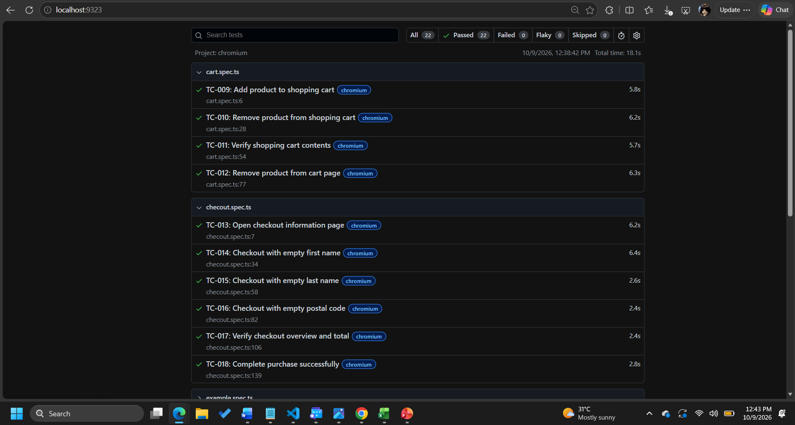
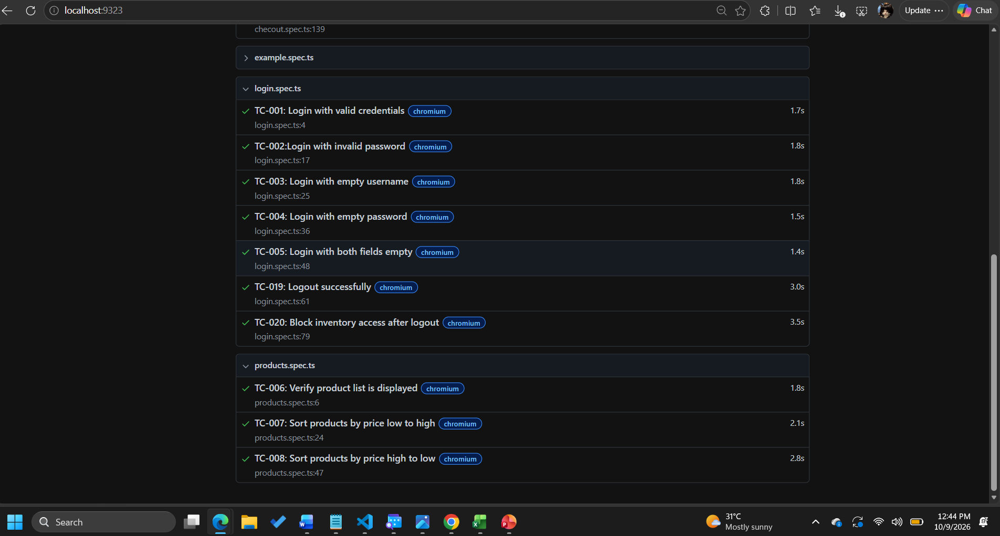

# E-Commerce Website — QA Testing & Automation Project

A QA portfolio project demonstrating manual testing, UI automation, API testing, test documentation, and version control using an e-commerce demo application.

## Table of Contents

* [Project Overview](#project-overview)
* [Technologies Used](#technologies-used)
* [Project Structure](#project-structure)
* [Screenshots](#screenshots)
* [Prerequisites](#prerequisites)
* [Installation and Setup](#installation-and-setup)
* [Running Automated Tests](#running-automated-tests)
* [Automated Test Coverage](#automated-test-coverage)
* [API Testing](#api-testing)
* [Manual Testing Documentation](#manual-testing-documentation)
* [Test Reports](#test-reports)
* [Troubleshooting](#troubleshooting)
* [Project Scope and Limitations](#project-scope-and-limitations)

## Project Overview

The purpose of this project is to practise and demonstrate essential Quality Assurance (QA) skills used in software development.

The project includes manual test scenarios and test cases, browser-based UI automation, API request and response validation, and test execution reporting.

Two separate public learning applications are used:

* **UI testing:** [SauceDemo](https://www.saucedemo.com/)
* **API testing:** [JSONPlaceholder](https://jsonplaceholder.typicode.com/)

The UI automation tests validate key e-commerce workflows, including authentication, product sorting, shopping cart operations, checkout, and logout.

## Technologies Used

| Technology | Purpose                                              |
| ---------- | ---------------------------------------------------- |
| TypeScript | Writing automated test scripts                       |
| Playwright | Browser automation and UI assertions                 |
| Node.js    | JavaScript/TypeScript runtime                        |
| npm        | Dependency and package management                    |
| Postman    | Manual API request execution and response validation |
| Git        | Version control                                      |
| Markdown   | Project and test documentation                       |
| Chromium   | Browser used for the recorded automated test run     |

## Project Structure

```text
ecommerce-qa-project/
├── tests/
│   ├── login.spec.ts
│   ├── products.spec.ts
│   ├── cart.spec.ts
│   └── checkout.spec.ts
├── docs/
│   ├── test-plan/
│   ├── test-cases/
│   ├── test-scenarios/
│   └── test-summary/
├── postman/
│   └── api-test-cases.md
├── bugs/
├── screenshots/
│   ├── reportImg1.png
│   ├── reportImg2.png
│   └── websiteImg.png
├── playwright.config.ts
├── package.json
├── package-lock.json
└── README.md
```

*Note: The screenshot filenames above assume the files use the `.png` extension. Adjust the names if your actual extensions differ. This structure describes the expected project layout; retain any additional files that exist in your repository.*

## Screenshots

### Website Under Test


### Playwright Test Report — Screenshot 1



### Playwright Test Report — Screenshot 2



## Prerequisites

Install the following before setting up the project:

1. **Node.js and npm** — download from [nodejs.org](https://nodejs.org/). npm is included with Node.js.
2. **Git** — download from [git-scm.com](https://git-scm.com/).
3. **Visual Studio Code** or another code editor — optional but recommended.
4. **Postman** — required if you want to repeat the API testing exercises. Download it from [postman.com](https://www.postman.com/downloads/).

Verify that Node.js, npm, and Git are available in your terminal:

```bash
node --version
npm --version
git --version
```

## Installation and Setup

### 1. Clone the repository

Replace the placeholder with the URL of your GitHub repository.

```bash
git clone <YOUR_GITHUB_REPOSITORY_URL>
cd ecommerce-qa-project
```

Alternatively, download the repository ZIP file from GitHub and extract it.

### 2. Install project dependencies

From the project root directory, run:

```bash
npm install
```

This installs the dependencies declared in `package.json`, including Playwright if it is listed there.

### 3. Install Playwright browsers

Run:

```bash
npx playwright install
```

To install only Chromium:

```bash
npx playwright install chromium
```

### 4. Open the project

Open the project folder in Visual Studio Code or your preferred editor.

Make sure the terminal is running from the directory containing `package.json` and `playwright.config.ts`.

## Running Automated Tests

### Run all tests in Chromium

```bash
npx playwright test --project=chromium
```

### Run tests from a specific file

Login tests:

```bash
npx playwright test tests/login.spec.ts --project=chromium
```

Product tests:

```bash
npx playwright test tests/products.spec.ts --project=chromium
```

Shopping cart tests:

```bash
npx playwright test tests/cart.spec.ts --project=chromium
```

Checkout tests:

```bash
npx playwright test tests/checkout.spec.ts --project=chromium
```

### Run tests in headed mode

Headed mode opens a visible browser window while the tests run:

```bash
npx playwright test --project=chromium --headed
```

### Run a single test by its title

For example:

```bash
npx playwright test -g "Login with valid credentials" --project=chromium
```

## Automated Test Coverage

The UI automation suite contains 20 test cases organised by feature.

| Test file          | Test IDs                     | Coverage                                               |
| ------------------ | ---------------------------- | ------------------------------------------------------ |
| `login.spec.ts`    | TC-001–TC-005, TC-019–TC-020 | Login validation, logout, protected-page access        |
| `products.spec.ts` | TC-006–TC-008                | Product listing and price sorting                      |
| `cart.spec.ts`     | TC-009–TC-012                | Adding, removing, and verifying cart items             |
| `checkout.spec.ts` | TC-013–TC-018                | Checkout fields, order totals, and purchase completion |

The tests use Playwright assertions to verify expected outcomes, such as page titles, URLs, validation messages, cart contents, and checkout totals.

## API Testing

API testing exercises are performed separately using JSONPlaceholder, a public test API.

Documented exercises include:

* Retrieving an existing post using `GET`
* Requesting a nonexistent post and checking the response
* Creating a post using `POST`
* Checking HTTP status codes and JSON response fields
* Exploring missing fields and malformed JSON

The API test cases are documented in `postman/api-test-cases.md`.

These exercises demonstrate basic API testing skills. They do not test SauceDemo's internal backend or establish that the e-commerce website's APIs have been validated.

## Manual Testing Documentation

The `docs/` directory contains the project's manual testing documentation:

* **Test plan:** testing objectives, scope, approach, environment, and exit criteria.
* **Test scenarios:** high-level workflows and exploratory testing observations.
* **Test cases:** test steps, expected results, actual results, and outcomes.
* **Test summary:** overall execution results and conclusions.

The `bugs/` directory is reserved for defect reports and supporting evidence.

## Test Reports

Generate an HTML report by running:

```bash
npx playwright test --project=chromium --reporter=html
```

Open the report with:

```bash
npx playwright show-report
```

Playwright serves the report locally, usually at `http://localhost:9323`. Open the displayed URL in your browser. Stop the report server with `Ctrl + C` in the terminal.

### Recorded Results

The latest recorded Chromium run reported **20 passing UI tests**. The screenshots in the `screenshots/` folder provide visual evidence of the website and test reports.

Results may vary if the website, test code, configuration, or environment changes. Run the tests again to verify the current state.

## Troubleshooting

### Playwright browser is missing

Run:

```bash
npx playwright install chromium
```

### No tests are discovered

Check that:

* Test files are inside the configured test directory.
* Test filenames match the patterns in `playwright.config.ts`.
* Each test file imports `test` and `expect` from `@playwright/test`.

### Tests fail unexpectedly

Run a specific test file to narrow down the problem:

```bash
npx playwright test tests/login.spec.ts --project=chromium
```

Review the terminal output and HTML report for details. A failure may be caused by an application change, an incorrect selector, timing, or a genuine defect; investigate before classifying it.

### Screenshots do not display on GitHub

Verify that the screenshot files exist inside `screenshots/` and that the names and extensions in the Markdown links match the actual files exactly. GitHub paths are case-sensitive.

## Project Scope and Limitations

This is a learning and portfolio project using public demo services. It is not a production e-commerce application or a client engagement.

* UI automation targets the public SauceDemo website.
* API practice uses JSONPlaceholder independently of SauceDemo.
* The recorded automated run uses Chromium; other browser projects should be tested separately before claiming cross-browser coverage.
* Results reflect the application and environment at the time of execution.

## Learning Objectives

This project provides hands-on practice with:

* Software testing fundamentals and test case design
* Positive, negative, and exploratory testing
* UI automation with Playwright and TypeScript
* API requests and response assertions using Postman
* Automated test reporting
* Feature-based test organisation
* Git version control and technical documentation
